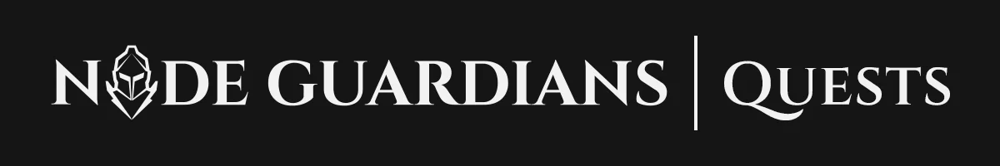
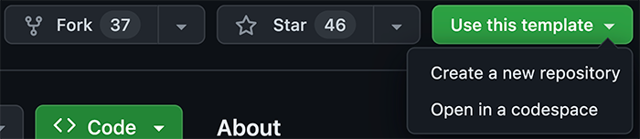
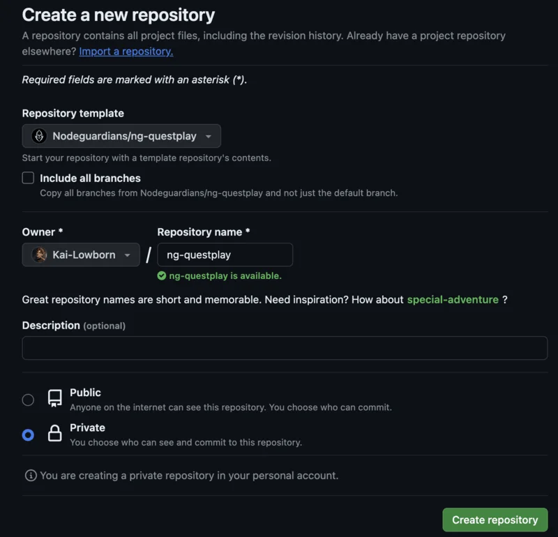
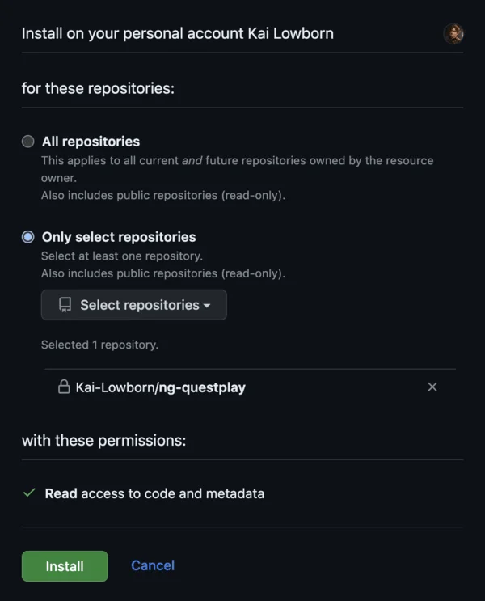

Welcome guardian. The road out will be treacherous, but remember, fortune favors the brave.

`ng-questplay` is a lightweight CLI-based application that helps you manage your quests as you venture out into [the wilderness](https://nodeguardians.io/) to complete quests and fulfill your duty as a _Node Guardian_.

## Getting Started

We **highly recommend** that you set up Questplay by following [our tutorial](https://nodeguardians.io/quests/setting-up?s=devhub-quests). But here are the brief steps anyways.

1. From this repository's file list, select **Use this template** > **Create a new repository**.



2. Name your repository `ng-questplay` and mark it as private. Once done, select **Create repository**.



3. Next, visit and install [our Github application](https://github.com/apps/node-guardians/installations/select_target). When prompted where to install, select your profile, then **only selected repositories** > **ng-questplay**



4. Download your newly created repository onto your local machine.

    ```
    git clone https://github.com/{GITHUB_USERNAME}/ng-questplay.git
    ```

    > 💡 Replace `{GITHUB_USERNAME}` with your Github username!

5. Next, run the following command to install the required dependencies.

    ```
    cd ng-questplay
    npm run start-adventure
    ```

## Finding a Quest

Run the following command to find and download a specific quest into your repo.

```
quest find
```

Alternatively, you can immediately specify the quest name (hyphenated, no spaces).

```
quest find using-signatures
```

## Running a Local Test

To run a local test in a quest, first make sure you are in the quest folder. Then:

```
# Run local tests in Part 1
quest test 1
```

```
# Run all local tests
quest test
```

If you have Foundry installed, our quests also support local Foundry tests. To configure your preferred framework to Foundry:

```
quest set-framework foundry
```

After which, running `quest test` will trigger Foundry tests to run instead. The native command `forge test` also triggers Foundry tests, albeit in a less readable format. However, using `forge` gives you access to Foundry's many features (e.g., `-vvv` flag).

## Submitting a Quest

To submit a quest for verification, first make sure you are in the quest folder.
Commit all your changes into your local repository. Then run:

```
quest submit
```

This command pushes your code to your remote repository in Github for verification.

## Running the Cross-Chain Bridge

Certain quests require you to run a cross-chain bridge from **Avalanche Fuji** to **Ethereum Goerli**. These quests will provide you a way to obtain a 32-byte bridge hash. Then, run the following command.

> 💡 Replace `{BRIDGE_HASH}` with your 32-byte bridge hash!

If the bridge hash is valid, you will be given a signature required to process any cross-chain transaction.

## Updating CLI

To update the CLI, run:

```
quest update
```
