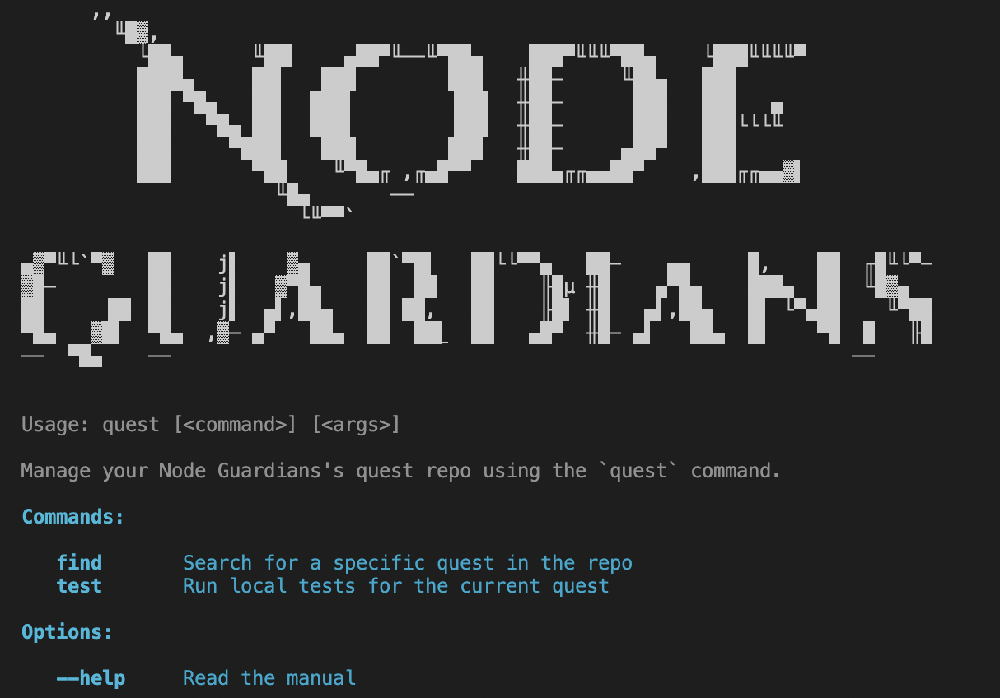

# Setting Up

> _Before training can begin, you will need equipment. Let us get some proper gear from the armoury._

Many of the quests in Node Guardians will require you to build and test Solidity smart contracts locally. This way, you will be able to work from the comfort of your preferred IDE. In this section, we will walk through how to set up your local environment.

## Setting Github Username 

These quests will require you to connect and use your Github to submit your work for verification. To connect your Github to Node Guardians:

1. On the top right, click on your character icon and find your "Account Settings"
2. Under the Github field, fill in your Github username

## Configuring Questplay

We have published a repository, called **Questplay**, on Github to help you manage all your future Solidity quests. This repository comes with a CLI-based application that helps you download, test, and submit quests.

1. Visit [Questplay on Github](https://github.com/Nodeguardians/ng-questplay) and **fork the repo**.
2. Then, [install the NG Validation application](https://github.com/apps/ng-validation) on your forked repo. This application allows Questplay to send your submissions to Node Guardian's backend for verification. 
3. Next, clone your forked repo onto your local device.
    ```
    git clone https://github.com/{GITHUB_USERNAME}/ng-questplay.git
    ```

    > 💡 Replace `{GITHUB_USERNAME}` with your github handle!

4. Navigate to your repo's root folder and install the required dependencies.

    ```
    cd ng-questplay
    npm install && npm link
    ```
 
5. To verify that Questplay has been properly installed, run the following command.

    ```
    quest
    ```

    You should be seeing output similar to the one below.

    


## Your Task

Follow the instructions detailed above and set up your Questplay repository!
