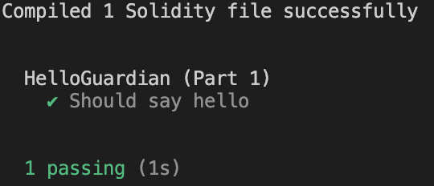

# Completing a Quest

> _Reporting to the training fields, you join other apprentices practicing their magic. Try casting a simple spell._

Now that the quest is downloaded into your local environment, let us try building a simple contract and submitting it for verification.

When you download a quest onto Questplay, you download all the template contracts you will need to complete. You also download a set of hardhat tests which you can run to verify that your code works.

In the folder of your downloaded quest `build-tutorial/`, you should see the template contract file `contracts/HelloGuardian.sol`. Open the file and complete the `hello()` function.

Afterwhich, you verify your work locally by running the following commands in the terminal.

```
cd ./campaigns/stand/build-tutorial
quest test 3
```

We run `quest test 3` since we're testing part 3!

> 💡 Remember to navigate to the appropriate quest directory first, before running `quest test`. If not, Questplay will not know which tests to run!

If done correctly, you should see output similar to this.



## Your Task

Complete `HelloGuardians.sol` and test it locally!
