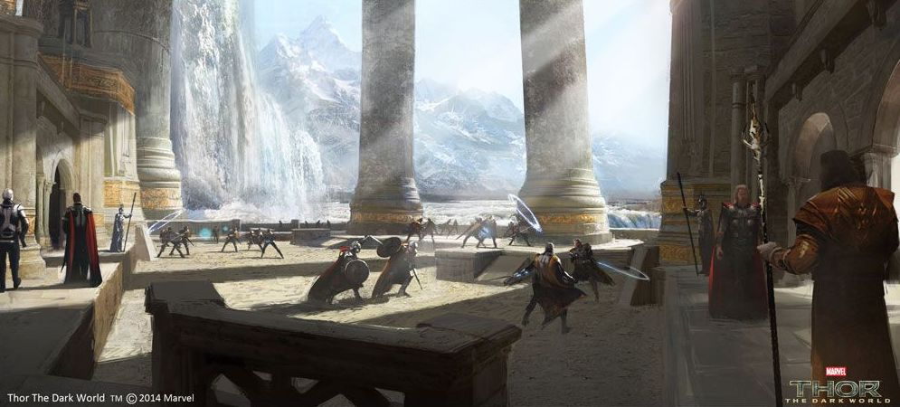

# Prelude

Reporting to the Order's training grounds, you take in the cold smell of sweat and steel. All around you is the rattling of battered swords, and the hissing of imperfected spells.

> Kai Lowborn "Ah, you must be the other new guy! Say, do you know where the barracks are?"

You turn around to see a scrawny figure, lugging a large rucksack.

> Kai Lowborn "I'm Kai, glad to see I'm not the only fresh blood today. Let us keep each other close!"

Your adventures as a cryptomancer will be songs to be sung. But before you can embark on perilous quests, perhaps you should settle into camp with your new-found friend first...

